import { LinkButton, Card, Aside } from '@astrojs/starlight/components';

import primitive_landmine_demo from '/videos/guides/level_editor_objects/primitive_landmine_demo.webm';
import proper_landmine_demo from '/videos/guides/level_editor_objects/proper_landmine_demo.webm';
import uncanny_explode_demo from '/videos/guides/level_editor_objects/uncanny_explode_demo.webm';
import land_mine_toggle_demo from '/videos/guides/level_editor_objects/land_mine_toggle_demo.webm';

> Last updated: 2026/09/10 for UCG v1.0.2

Ever wanted to spice up your custom levels with some new gimmick?

In this guide, we will port a singleplayer-only object (the land mine from 5-18) to the level editor and give it a new interesting interaction!

:::note
This guide assumes that you:

1. Have some basic understanding of Godot (GDScript, signals, the scene tree, etc.).
2. Have read through [mod script basics](/guides/modscript_basics/).
3. Have the UCG project ready and open in Godot. If not, [do it beforehand](/getting-started/).
:::

<details>
<summary>Time is of the essence, I want the fastest possible TLDR</summary>
1. Objects are just Godot `.tscn`s. The root node should be an `Area2D` or derivative with a valid collision shape attached.
2. Make sure the object's "main" sprite is the last `Sprite2D`/`AnimatedSprite2D` child of the object scene's root node.
3. The level editor scene can be found at `res://assetsNEW/scenes/game/menus/leveleditor/level_editor.tscn`.
4. Create an `EditorObject` for the object and add it to `levelEditor.objectScenes`.
5. Add an entry for your object in `levelEditor/HUD/tabs/objectsTab/ItemList`.
6. Make sure (4.) and (5.) have the same index in their respective lists.
7. During runtime, the level editor's location in the scene tree is `Master/FullEditorUi/levelEditor`.
</details>


## Getting the level editor to recognize our object

For an object to be useable in the level editor, it must be referenced in two different locations:
- `levelEditor.objectScenes`: this is a list of editor-specific properties for every object that can be placed in the level editor. Without it, the level editor won't know what `.tscn` file to load for our object!
- `levelEditor/HUD/tabs/objectsTab/ItemList.Items`: this is the list of objects that appears in the "Objects" tab in the level editor. Without it, we can't choose our object and place it in the level!

:::caution
Our custom object must have the **same index** in both of these lists. That is, if our land mine is item #24 in `objectScenes`, it must also be item #24 in `ItemList`. Otherwise, placing your object may not work as intended or even crash the game!
:::

### Defining the level editor properties for our object

The level editor has a variable called `objectScenes`, which is an array of `EditorObject`s, one for each object that can be placed in the level editor.  Each `EditorObject` tells the level editor two things about that object:
1. What `.tscn` file to load when the object is placed.
2. What variables are configurable (like an enemy's speed or a jump pad's direction) when the object is selected in the level editor's "Selection" mode.

Let's add a new `EditorObject` for our land mine to this array. Open up the level editor's scene located at `res://assetsNEW/scenes/game/menus/leveleditor/level_editor.tscn`. Select the root `levelEditor` node of our scene and look for the `Object Scenes` property in the Inspector. Click it to expand the list.

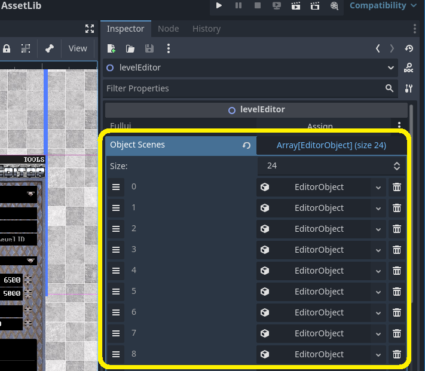

Click the `|>` button to navigate to the end of the list and then click `Add Element`. Select the new `<empty>` entry that gets added and choose `New EditorObject`.  Now click that `EditorObject`.  We can leave the `Variables` field alone for now, but for `Object` we will select our land mine's `.tscn` file (`res://assetsNEW/scenes/objects/gimmicks/land_mine.tscn`).

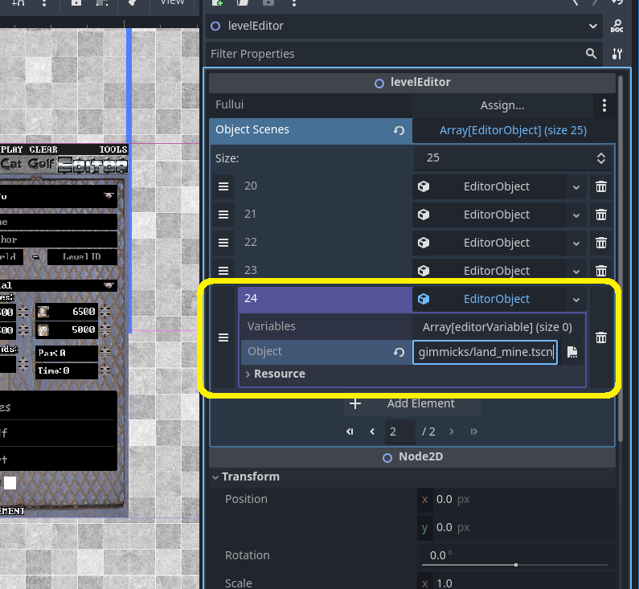

And with that, the level editor now supports land mines!  However we can't actually place them in the editor yet; for that we need the next step.

### Adding our object to the Objects tab

In the scene tree, click the node `HUD/tabs/objectsTab/ItemList`. Expand the `Items` property in the Inspector and you should see some familiar faces.

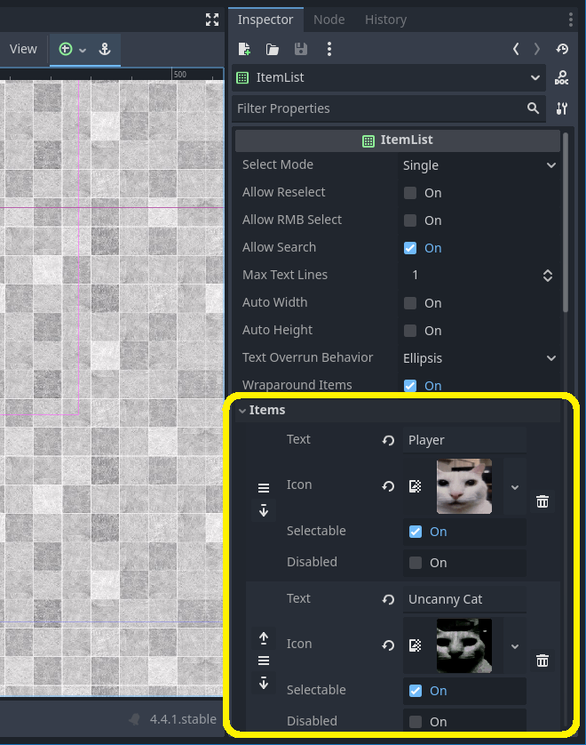

Let's add our land mine to this list. Scroll down, click the `|>` symbol to skip to the end of the list, and then click the `Add Element` button. Fill out the `Text` and `Icon` fields, but leave the `Selectable` option checked and the `Disabled` option unchecked.

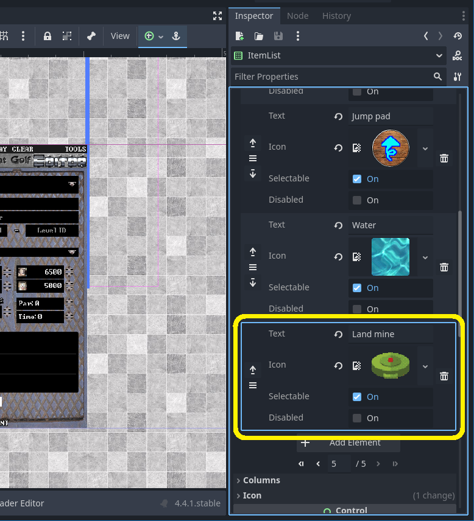

With that, we can now view land mines in the level editor and place them!

<video controls class="starlight-video" width="100%" preload="metadata">
  <source src={primitive_landmine_demo} type="video/webm" />
  Your browser does not support the video tag.
</video>

However, if you play around for a bit, you may notice that there are a few lingering issues...

## Optimizing our object for the level editor

To say that our object "works" is only barely technically true. Depending on what object you port, it may have the following problems:
- The preview image doesn't appear when placing the object
- The object can't be selected after it's placed

Fixing these issues would require modifying the object itself. However, for compatibility reasons I recommend that we instead create a new "level editor compatible" version of the object that the level editor will use instead. This not only prevents our mod from having unintended side effects in the singleplayer mode, but also makes our mod less likely to conflict with other mods that affect the base game.

### Duplicating the original object

Let's start with duplicating our object's scene (`res://assetsNEW/scenes/objects/gimmicks/land_mine.tscn`), giving it a new name, and placing it in our mod's folder. Following the base game's naming convention (e.g. `water_death.tscn` and `water_deathEditor.tscn`), we will name our new scene `land_mineEditor.tscn`.

Don't forget to also duplicate and rename the script file (`res://assetsNEW/scenes/objects/gimmicks/land_mine.gd`)!

Our mod folder should now look like this:

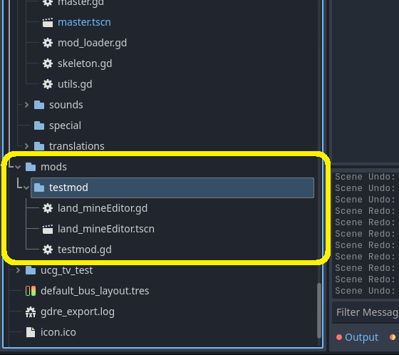

Now let's open up our newly-duplicated scene. The root "LandMine" node is still pointing to the original `land_mind.gd` script, so let's fix that and change it to `land_mineEditor.gd`. Then, open up the script.

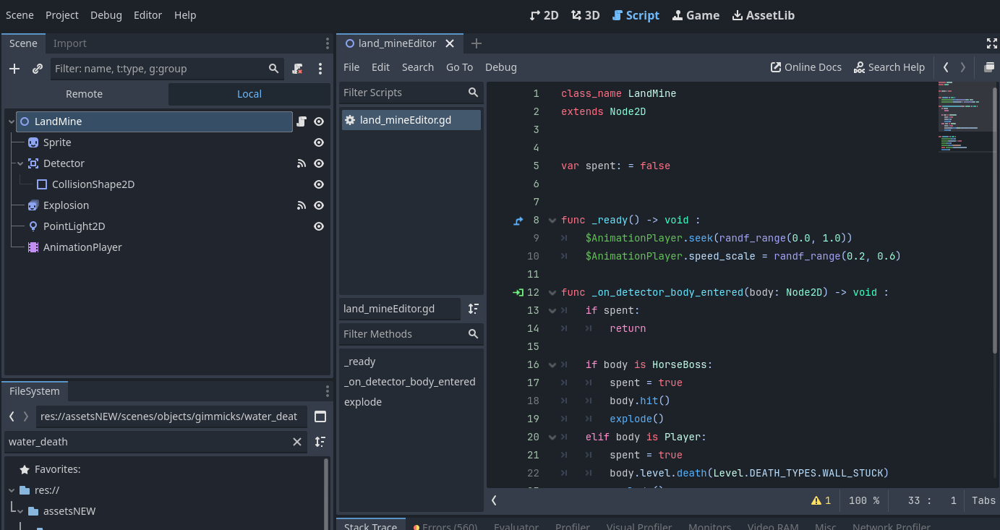

You may or may not see an error on the first line (depending on which script Godot parses first):
> `Parser Error: Class "LandMine" hides a global script class.`

That's because our new script is trying to declare a `LandMine` class, but one is already being declared in the original script! Let's rename this class to `LandMineEditor`.

```diff lang="gd"
// land_mineEditor.gd
- class_name LandMine
+ class_name LandMineEditor
extends Node2D

var spent: = false

func _ready() -> void :
	$AnimationPlayer.seek(randf_range(0.0, 1.0))
	$AnimationPlayer.speed_scale = randf_range(0.2, 0.6)
(...)
```

:::note
If you give a `class_name` starting with "Editor", Godot will hide that class from all class-selection dialogs. This will **NOT** affect the objects behavior in any way, but may make working with the class in Godot less convenient.
:::

Finally, let's update the `EditorObject` in `levelEditor.objectScenes` to point to our new scene file (`res://mods/testmod/land_mineEditor.tscn`) instead of the base game one.

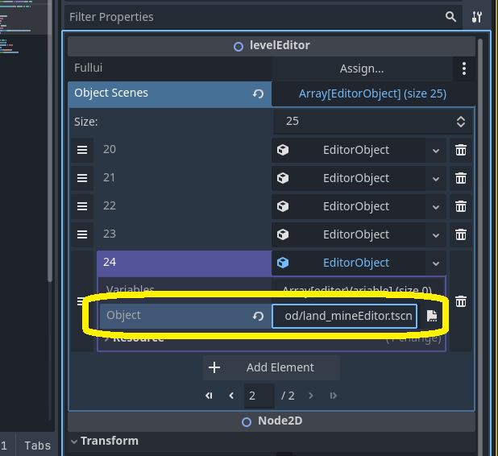

And with that, the level editor now uses our modded object instead of the base game one!

:::caution
At this point, levels created using the level editor will use our custom land mine object instead of referring to the base game object. This means that levels created with our modded object will not load properly if the mod is missing/disabled.
:::

:::danger
Loading a level with modded object(s) **without** the necessary mod(s) will **NOT** give a warning; the level will simply partially load.

**Saving** or **playing** the level in this state cause the level to **PERMANENTLY lose all data that failed to load**.
:::

### Meeting the level editor's expectations

Object scenes need to be structured in a specific way in order for UCG to accurately present and manipulate them in the level editor. Specifically:
- The very **last** `Sprite2D` or `AnimatedSprite2D` child of the root node is used as the placement preview image.
- The root node must be of type `Area2D` (or subtype) with a valid collision shape in order to be selectable in "Selection" mode.

#### Re-ordering the object's main sprite

To fix the placement preview of our land mine, simply move the "Sprite" node (which has the actual land mine texture) to the bottom of the scene tree. This will have the editor use it instead of the "Explosion" node (which was causing our preview image to be blank).

:::note
Objects with index #0 ("Player") and #2 ("GoalHole") have hardcoded preview images. This won't have any impact unless you choose to remove or replace base game objects (but why would you do that?).
:::

#### Making the root node an `Area2D`

Next, let's fix the land mine being unselectable. Right-click the root node, choose `Change Type...`, and then choose `Area2D`. Next, add a child node of type `CollisionShape2D`. Choose an appropriate shape in the Inspector under `CollisionShape2D > Shape` and finally transform it to your liking in the 2D view. This will act as the selection hitbox of the object.

Here is what that looks like for our custom land mine:

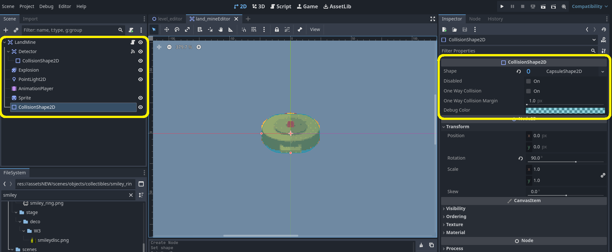

And just like that, our land mine behaves as if it always belonged in the level editor!

<video controls class="starlight-video" width="100%" preload="metadata">
  <source src={proper_landmine_demo} type="video/webm" />
  Your browser does not support the video tag.
</video>

## Adding new (configurable) features to our object

:::note
If you are satisfied with your object's behavior as-is, feel free to proceed to [converting your changes into a mod script](#converting-our-changes-into-a-mod-script).
:::

Some objects have variables that can be set in the Objects tab when they are selected.

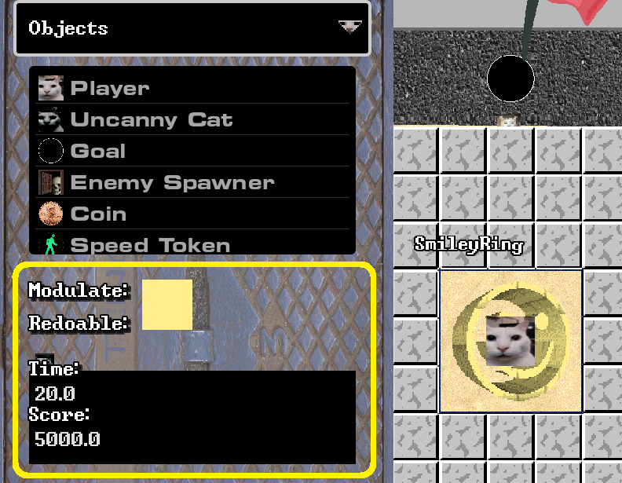

Let's add an extra interaction to our land mine and give it an on/off toggle in the level editor.

### Coding the new behavior

In the base game, only two entities can interact with the land mine: the player and the horse boss. We will modify our land mine so that Uncanny can also trigger and be blown up by the land mine.

The land mine's script is pretty small, so the relevant code is pretty easy to find:
```gd
// land_mineEditor.gd
(...)
func _on_detector_body_entered(body: Node2D) -> void :
	if spent:
		return

	if body is HorseBoss:
		spent = true
		body.hit()
		explode()
	elif body is Player:
		spent = true
		body.level.death(Level.DEATH_TYPES.WALL_STUCK)
		explode()

func explode() -> void :
	$PointLight2D.hide()
	$Detector.monitoring = false
	$Sprite.hide()
	$Explosion.play(&"explode")
	await $Explosion.animation_finished
	queue_free()
```

The `_on_detector_body_entered()` function is connected to the `body_entered` signal that emits from the "Detector" node when a `Node2D` enters its area. To extend the logic to include Uncanny, we just add a test for Uncanny's class (`Ghost`). Since `Ghost`s don't have an explicit routine for dying, we'll just unceremoniously delete them from existence.

```diff lang="gd"
// land_mineEditor.gd
(...)
func _on_detector_body_entered(body: Node2D) -> void :
	if spent:
		return

	if body is HorseBoss:
		spent = true
		body.hit()
		explode()
	elif body is Player:
		spent = true
		body.level.death(Level.DEATH_TYPES.WALL_STUCK)
		explode()
+	elif body is Ghost:
+		spent = true
+		body.queue_free()
+		explode()

(...)
```

Let's test it out. Uncanny goes over the land mine and... nothing?

That's because we also need to set the "Detector"'s collision mask to include the collision layer that Uncanny is on: `Layer 3` (Ghost).

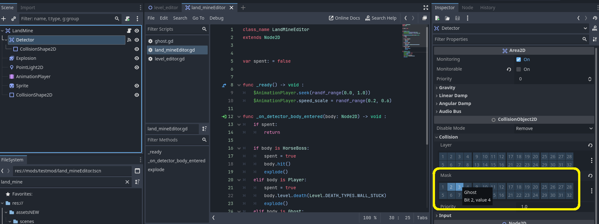

Now if you run a test, Uncanny properly interacts with the land mine, but the explosion is completely silent! What gives?

That's because the explosion sound is actually a part of the player's stuck-in-a-wall dying sequence and is attached to the player scene, not the land mine.

So let's give the land mine its own copy of the explosion by copy-pasting the `Sounds/WallDeath` node from the player scene (`res://assetsNEW/scenes/objects/player/player.tscn`) to the root of our `land_mineEditor.tscn` scene. Feel free to rename the node to something a bit more descriptive like "ExplosionSfx" to distinguish it from the explosion sprite.

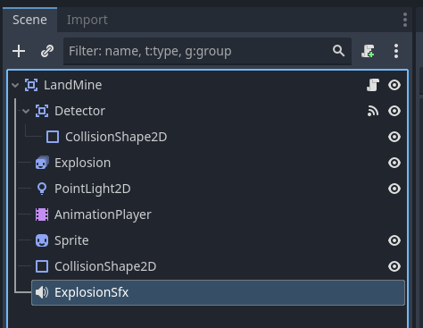

Finally let's add the relevant code. Since this explosion sound only needs to play when *Uncanny* interacts with the land mine, we'll put it here instead of the `explode()` function.

```diff lang='gd'
// land_mineEditor.gd
(...)
	elif body is Ghost:
		spent = true
+		$ExplosionSfx.play()
		body.queue_free()
		explode()
(...)
```

And all the functionality is done! Uncanny dies a well-heard explosive death when they step on the land mine.

<video controls class="starlight-video" width="100%" preload="metadata">
  <source src={uncanny_explode_demo} type="video/webm" />
  Your browser does not support the video tag.
</video>

<details>
<summary>Full code</summary>
```gd
// land_mineEditor.gd
class_name LandMineEditor
extends Node2D

@export var can_uncanny_interact: bool = true

var spent: = false

func _ready() -> void :
	$AnimationPlayer.seek(randf_range(0.0, 1.0))
	$AnimationPlayer.speed_scale = randf_range(0.2, 0.6)

func _on_detector_body_entered(body: Node2D) -> void :
	if spent:
		return

	if body is HorseBoss:
		spent = true
		body.hit()
		explode()
	elif body is Player:
		spent = true
		body.level.death(Level.DEATH_TYPES.WALL_STUCK)
		explode()
	elif body is Ghost && can_uncanny_interact:
		spent = true
		$ExplosionSfx.play()
		body.queue_free()
		explode()

func explode() -> void :
	$PointLight2D.hide()
	$Detector.monitoring = false
	$Sprite.hide()
	$Explosion.play(&"explode")
	await $Explosion.animation_finished
	queue_free()

```
</details>

### Adding the level editor settings for our object

Time to add the "configurable" part of our configurable behavior. Create a new exported variable `can_uncanny_interact` and add it as a condition for our land mine to be triggered by Uncanny.

```diff lang='gd' " && can_uncanny_interact"
// land_mineEditor.gd
class_name LandMineEditor
extends Node2D

+ @export var can_uncanny_interact: bool = true

var spent: = false

func _ready() -> void :
	$AnimationPlayer.seek(randf_range(0.0, 1.0))
	$AnimationPlayer.speed_scale = randf_range(0.2, 0.6)

func _on_detector_body_entered(body: Node2D) -> void :
	if spent:
		return

	if body is HorseBoss:
		spent = true
		body.hit()
		explode()
	elif body is Player:
		spent = true
		body.level.death(Level.DEATH_TYPES.WALL_STUCK)
		explode()
-	elif body is Ghost:
+	elif body is Ghost && can_uncanny_interact:
		spent = true
		$ExplosionSfx.play()
		body.queue_free()
		explode()
(...)
```

Now open up the `levelEditor.tscn` scene and revisit the `Object Scenes` property in the Inspector. Click our land mine's `EditorObject` (should be item #24 if this is your first modded object).  Select the `Variables` field and then choose `Add Element`. In the newly created item, click `<empty>` and then `New editorVariable`. Finally, expand our new `editorVariable` and fill in the necessary fields.
- `Name`: This is the editor variable's label in the level editor (e.g. "Max Speed", "Dir X", etc.). For this guide, we will put "Can Uncanny interact"
- `Varname`: This is the object's internal script variable that the editor variable is linked to. In our example, this will be "can_uncanny_interact". Be sure to exactly match spelling/case-sensitivity!
- `IsEnum`/`Is Bool`/`Enum Range`/`Enum Names`: These settings determine how the editor variable is input in the level editor. Since our option is a simple boolean, check `Is Bool` and leave the other fields blank.

Our modified `EditorObject` should look like this:

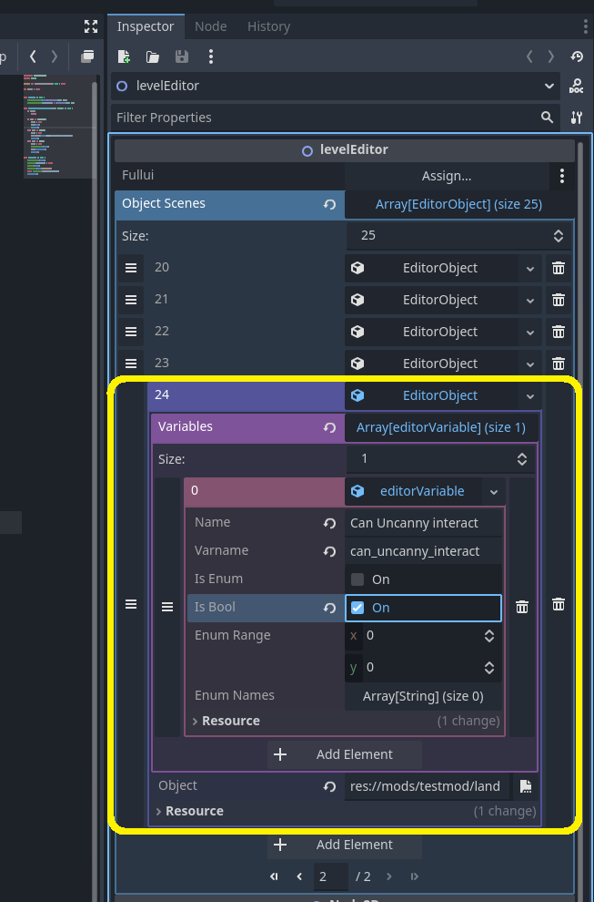

Hop in the level editor and test your changes out! Uncanny should only trigger land mines that have the "Can Uncanny interact" toggle enabled.

<video controls class="starlight-video" width="100%" preload="metadata">
  <source src={land_mine_toggle_demo} type="video/webm" />
  Your browser does not support the video tag.
</video>

<Aside type="caution" title="Known bug">
There is currently a bug in UCG where certain object settings do not save properly when selecting multiple objects of the same type in a row. As a workaround, deselect (escape key) and then reselect objects you want to edit the settings of.
</Aside>

## Converting our changes into a mod script

If you've read [mod script basics](/guides/modscript_basics/), you would understand that exporting our mod in its current state would lead to all sorts of compatibility issues, due to changes we made directly to `level_editor.tscn`. Let's convert these manual changes into code.

As a reminder, the manual changes we made to the level editor scene were:
- Adding a new `EditorObject` for our custom object to `levelEditor.objectScenes`
- Adding a new entry to `levelEditor/HUD/tabs/objectsTab/ItemList` for our custom object

Let's open up our mod's script at `res://mods/testmod/testmod.gd`. We can use the default code as a starting point:

```gd
// testmod.gd
extends Node

func _init() -> void :
	print("testmod: pre-initialization")

func _enter_tree() -> void :
	print("testmod: main initialization")
	var master = get_tree().current_scene as Master
	if master:
		print("testmod: painting the town red")
		master.modulate = Color.RED

func _ready() -> void :
	print("testmod: post-initialization")

```

Instead of hooking to nodes during gameplay like in [Node Interception 101](/guides/modscript_basics/#node-interception-101), we will make our mod run during the game's startup. Since we want our logic to run just once, we'll put our code in `_ready()`. First, let's (pre)load the level editor `PackedScene` and instantiate it to get access to the packed nodes.

```diff lang='gd'
// testmod.gd
extends Node

-func _init() -> void :
-	print("testmod: pre-initialization")

-func _enter_tree() -> void :
-	print("testmod: main initialization")
-	var master = get_tree().current_scene as Master
-	if master:
-		print("testmod: painting the town red")
-		master.modulate = Color.RED

func _ready() -> void :
-	print("testmod: post-initialization")
+	var level_editor_packed_scene: = preload("res://assetsNEW/scenes/game/menus/leveleditor/level_editor.tscn")
+	print("[EditorLandMine] Patching '%s'..." % level_editor_packed_scene.resource_path)
+	var level_editor_node: = level_editor_packed_scene.instantiate() as levelEditor
```

For the `objectScenes` change, we can utilize `Resource`s to simplify our code. Open up the root `levelEditor` node in the Inspector and find the `EditorObject` we added to `Object Scenes`. Right-click the `EditorObject` and choose `Save As...`. Save the resource to your mod folder.

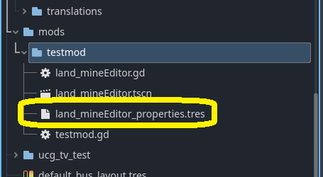

Once the resource is saved, delete our `EditorObject` from `Object Scenes`, so that the last entry is now #23 (for water). Our script will handle adding to `Object Scenes` instead:

```diff lang='gd'
// testmod.gd
(...)

func _ready() -> void :
	var level_editor_packed_scene: = preload("res://assetsNEW/scenes/game/menus/leveleditor/level_editor.tscn")
	print("[EditorLandMine] Patching '%s'..." % level_editor_packed_scene.resource_path)
	var level_editor_node: = level_editor_packed_scene.instantiate() as levelEditor
+	# Object Scenes
+	var land_mine_editor_object: = preload("res://mods/testmod/land_mineEditor_properties.tres")
+	level_editor_node.objectScenes.append(land_mine_editor_object)
```

For the `ItemList` change, navigate to the node at `HUD/tabs/objectsTab/ItemList` and find our land mine entry at the very end of `Items` in the Inspector. The entries aren't a special type, so there's no need to mess with `Resource`s here. Just delete the land mine element (so that the last one is water once again) and modify our mod script:

```diff lang='gd'
// testmod.gd
(...)

func _ready() -> void :
	var level_editor_packed_scene: = preload("res://assetsNEW/scenes/game/menus/leveleditor/level_editor.tscn")
	print("[EditorLandMine] Patching '%s'..." % level_editor_packed_scene.resource_path)
	var level_editor_node: = level_editor_packed_scene.instantiate() as levelEditor
	# Object Scenes
	var land_mine_editor_object: = preload("res://mods/testmod/land_mineEditor_properties.tres")
	level_editor_node.objectScenes.append(land_mine_editor_object)
+	# Item List
+	var land_mine_item_texture: = preload("res://assetsNEW/graphics/gimmicks/landmine.png") as Texture2D
+	var level_editor_object_list: = level_editor_node.get_node("HUD/tabs/objectsTab/ItemList") as ItemList
+	level_editor_object_list.add_item("Land mine", land_mine_item_texture)
```

One strength of having our changes as GDScript is that we can check the important caveat that our land mine has the same entry in both lists. If our `ItemList` and `objectScenes` are different sizes, we know something went wrong.

After that, all that's left is to pack our node changes back into the source `PackedScene`.

```diff lang='gd'
// testmod.gd
extends Node

func _ready() -> void :
	var level_editor_packed_scene: = preload("res://assetsNEW/scenes/game/menus/leveleditor/level_editor.tscn")
	print("testmod: patching '%s'..." % level_editor_packed_scene.resource_path)
	var level_editor_node: = level_editor_packed_scene.instantiate() as levelEditor
	# Object Scenes
	var land_mine_editor_object: = preload("res://mods/testmod/land_mineEditor_properties.tres")
	level_editor_node.objectScenes.append(land_mine_editor_object)
	# Item List
	var land_mine_item_texture: = preload("res://assetsNEW/graphics/gimmicks/landmine.png") as Texture2D
	var level_editor_object_list: = level_editor_node.get_node("HUD/tabs/objectsTab/ItemList") as ItemList
	level_editor_object_list.add_item("Land mine", land_mine_item_texture)
+	assert(level_editor_object_list.item_count == level_editor_node.objectScenes.size(),
+		"testmod: EditorObject and ItemList entry indicies do not match!")
+	level_editor_packed_scene.pack(level_editor_node)
+	print("testmod: main initialization complete")
```

Now launch the project and check that our land mine still works as intended. You can further confirm that our mod script is working by checking our `print()` statements in Godot's Output tab.

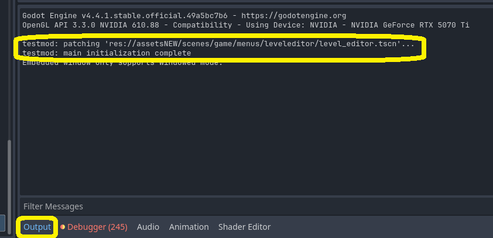

:::note
If your custom object is not showing in the level editor and no debug statements are getting logged, make sure that you have "Mods Enabled" checked in the game settings and that the test mod is activated. User-specific data/settings are shared between all instances of UCG, so for testing be sure to disable any other mods you might have enabled from your personal copy of UCG.

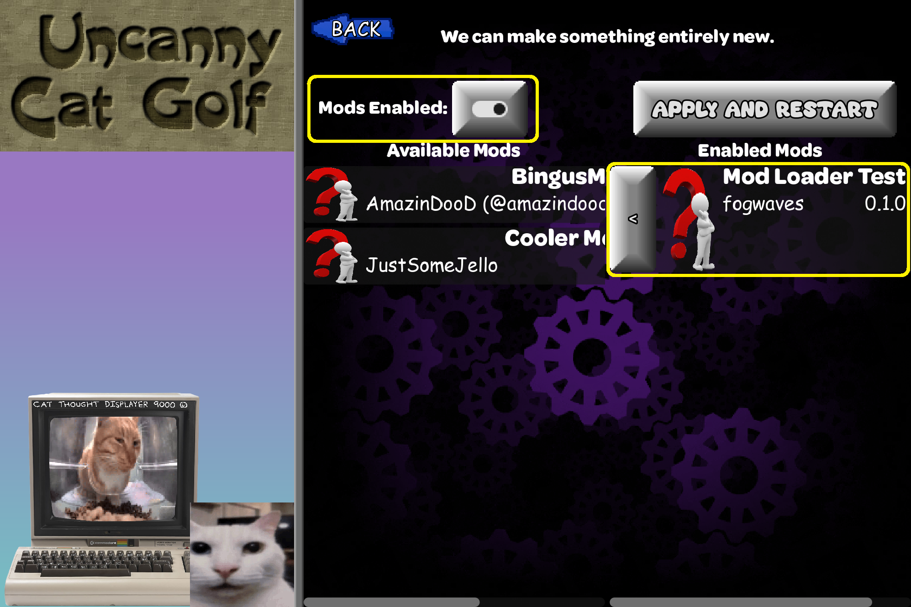
:::

## Conclusion

And with that, your mod is complete! Thank you for following along, and I hope you learned something new!

To package your mod so that other people can play it, see [this page](/getting-started/exporting/) on how to export your mod.

To spice up the appearance of your mod (and the mod settings page in general), check out [Cooler Mods](/resources/cooler_mods/) by Jell-O.

## FAQ and Troubleshooting

<details>
<summary>My mod doesn't seem to be doing anything!</summary>
- In the game's settings, make sure "Mods Enabled" is enabled and that the test mod is enabled.


- If you haven't exported your mod yet, make sure you are launching your game through Godot's `Run Project` button and not via some personal copy of the `.exe`
</details>

<details>
<summary>My custom object is showing up twice in the level editor!</summary>
You likely have a mix of manual scene changes and mod script code. I recommend making a [fresh decompiled copy of UCG](/getting-started/decomp/) and copying your `mods` folder and `mods.json` there. This will undo any changes you made to vanilla assets.
</details>

<details>
<summary>My mod keeps crashing the game!</summary>
- This could happen for a wide variety of reasons, most likely by trying to access the member of a variable that's `null`. Your best friend will be using the Godot debugger (or some good-old `print()` statements) to monitor your scripts' logic flow.
- This could also be the result of a mod conflict. Disable any other mods that are not your own (remember that if you enable mods in your personal copy of UCG, they will also be enabled in your debug build).
</details>

<details>
<summary>I can't select my custom object in the level editor!</summary>
The root node of the object's scene is likely a `Node2D` or some other node type that is *not* a derivative of `Area2D`, or is missing a valid collision shape.  See [Optimizing our object for the level editor](#optimizing-our-object-for-the-level-editor).
</details>

<details>
<summary>I made a new `class_name` but it's not showing up in any Godot dialog boxes or options!</summary>
- Make sure that the name is spelled correctly (I know, I know; promise me you'll still check)
- Class names starting with "Editor" are intentionally hidden by the Godot IDE. They will still work as intended, but you may want to consider renaming your class if this behavior inconveniences you.
</details>

<details>
<summary>I'm getting an error: `Parser Error: Class "<your_class_name_here>" hides a global script class.`</summary>
The same class name is being declared in two or more scripts. If you copied a vanilla object's script, be sure to give it a new, unique `class_name`.
</details>
